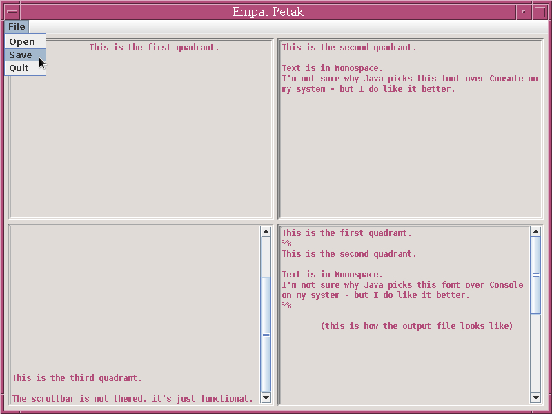

# EmpatPetak 
A simple record-jar-based text editor.

The idea is that you have a document with four text fields, that you can view and edit separately (My intention was for this to serve as a crude dashboard).
You can save and load the document to a single file - it is saved in record jar format.

> Caution! If you create a file with more than four records and then use this program on it, the extra records won't be loaded onto memory, so when you save it again, they will be lost.

# About the code

This is implemented in Java Swing. It's an okay example of how to use Swing components; In this program is my first time using JMenuBar.

It is not written in a professional manner. It's one big file containing everything (actually, the program itself is a monolithic object with no public interaction - the only thing you can do is start it up through #main or pass it events). It's not tested, nor scrutinised for security. It has hardcoded settings. And it doesn't have much features..

Thank you for your forgiveness.
